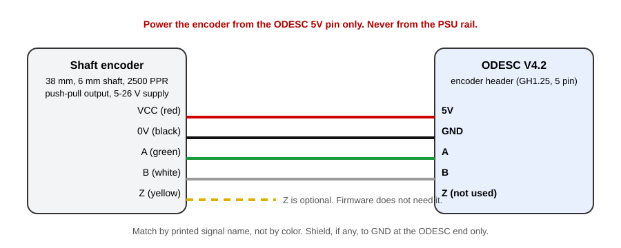

- TOC
{:toc}

---

{: .warning }
> **Never trust wire colors.** Match every connection by the name printed on the encoder label or datasheet.
> The colors below are what the seller lists for this encoder; confirm them on your unit before you plug anything in.

## ODESC V4.2 connectors

The board has four GH1.25 headers along the bottom edge and screw terminals along the top.
The upstream diagram below is the authority. The encoder header is the left one and is labelled
**GND, A, B, Z, 5V**.

| ODESC V4.2 terminal | Connect to                                                                   |
|---------------------|------------------------------------------------------------------------------|
| **A, B, C** (motor) | The three hoverboard phase wires, any order. Direction is fixed in software. |
| **DC +**            | PSU positive, through a fuse                                                 |
| **DC -**            | PSU negative                                                                 |
| **AUX + / AUX -**   | The 2 ohm 50 W brake resistor, either polarity                               |
| **Encoder header**  | GND, A, B, (Z), 5V from the encoder                                          |
| **USB-C**           | PC                                                                           |

The hoverboard motor's five thin Hall sensor wires stay unconnected. The firmware does not use them.

## Push-pull encoder wiring

| Encoder wire (per seller listing) | Signal | ODESC V4.2 encoder header pin          |
|-----------------------------------|--------|----------------------------------------|
| Red                               | VCC    | **5V**                                 |
| Black                             | 0V     | **GND**                                |
| Green                             | A      | **A**                                  |
| White                             | B      | **B**                                  |
| Yellow                            | Z      | leave unconnected (optional on **Z**)  |
| Shield / drain (if present)       |        | **GND** at the ODESC end only          |

### Why 5 V and not the PSU voltage

The encoder accepts 5 to 26 V, but a **push-pull output swings to whatever you feed it**.
Fed from 24 V it would put 24 V pulses on the controller's inputs. The STM32 on ODrive-family boards
is only 5 V tolerant on those pins. Power the encoder from the **5V pin on the encoder header** and nothing else.

### No pull-up resistors needed

Push-pull outputs actively drive both high and low, so unlike NPN open-collector encoders
they do not need external pull-up resistors. ODrive 3.6 derivatives already carry pull-ups on A, B and Z
for open-collector encoders and the push-pull driver simply overrides them.
The upstream warning about pull-ups on the [**Encoders**](hardware_encoder.html#omron-style) page applies to **NPN** models only.

### Current draw

This encoder is specified at up to about **150 mA**. That is a lot more than a magnetic encoder but well
within what the on-board 5 V regulator supplies. If the board resets when the encoder is plugged in,
power the encoder from a separate 5 V source and tie its ground to the ODESC ground.

### Cable routing

- Keep the encoder cable away from the three motor phase wires. Cross them at right angles if they must meet.
- If the encoder cable is shielded, ground the shield at the controller end only.
- Keep the run short. The encoder produces up to 100 kHz square waves; long unshielded runs next to a 20 A motor invite glitches.

### If position jumps or counts drift

Upstream documents a SEQURE dual-axis ODESC 3.6 with extra filter capacitors on the encoder lines that corrupt
fast edges. ODESC V4.2 is shown wired directly in the upstream diagram without that modification, so start
without touching the board. If position in FFBeast Setup jitters or slowly drifts after a few turns:

1. Confirm A and B are not swapped with GND or 5V.
2. Set Encoder CPR to 10000 and turn the wheel exactly 10 times. The position readout must return to the same value.
3. Only then ask on the [**FFBeast Discord**](https://discord.gg/5ZKD46zQSU) whether your V4.2 revision has encoder filter caps before you desolder anything.

## Brake resistor

Use the 2 ohm 50 W resistor that ships with the board on the **AUX** terminals.
Mount it on metal or in the airflow. When you spin the wheel fast the motor generates power back into the DC bus
and the resistor is what keeps the bus voltage under the PSU's over-voltage trip.
The amount dumped into it is the [**Braking resistor limit**](ffbeast_setup_controller.html#braking-resistor-limit) setting.

## PSU

The board is the 56 V version, which gives you headroom, not a target.

| PSU                          | Verdict for this build                                                                                             |
|------------------------------|--------------------------------------------------------------------------------------------------------------------|
| 19.5 V 240 W laptop brick    | Quiet, enclosed, safe. Enough for medium forces. Upstream author's own choice.                                     |
| **24 V 10-15 A (240-360 W)** | **Recommended.** Cheap, plenty of current, still far from the 56 V ceiling.                                        |
| 36 V 10 A                    | Slightly sharper transients (current rises faster into the winding). Needs a correctly set brake limit.            |
| 48 V and above               | Not worth it here. Regen spikes from a hoverboard motor add on top of the rail and 56 V is the absolute maximum.   |

The motor's torque is set by current, not voltage. Upstream measured up to 15 Nm at 15 A regardless of supply.
Voltage only buys you a faster rate of change of current, which shows up as crisper transients.
Beyond 24-36 V the gain is small and the risk is real.

{: .important }
> Put a **15-20 A fuse** in the positive PSU lead. The ODESC can pass 70 A continuously.
> A fault that would trip a fuse will otherwise cook wiring, the board, and the license bound to its serial number.
